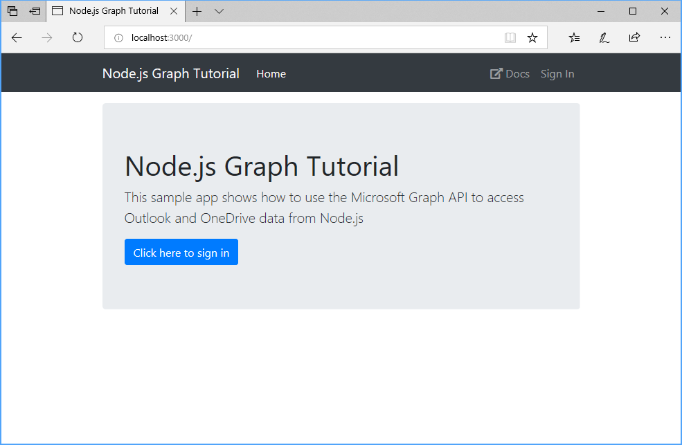

<!-- markdownlint-disable MD002 MD041 -->

In this exercise you will use [Express](http://expressjs.com/) to build a web app. If you don't already have the Express generator installed, you can install it from your command-line interface (CLI) with the following command.

```Shell
npm install express-generator -g
```

Open your CLI, navigate to a directory where you have rights to create files, and run the following command to create a new Express app that uses [Handlebars](http://handlebarsjs.com/) as the rendering engine.

```Shell
express --hbs graph-tutorial
```

The Express generator creates a new directory called `graph-tutorial` and scaffolds an Express app. Navigate to this new directory and enter the following command to install dependencies.

```Shell
npm install
```

Once that command completes, use the following command to start a local web server.

```Shell
npm start
```

Open your browser and navigate to `http://localhost:3000`. If everything is working, you will see a "Welcome to Express" message. If you don't see that message, check the [Express getting started guide](http://expressjs.com/starter/generator.html).

Before moving on, install some additional gems that you will use later:

- [dotenv](https://github.com/motdotla/dotenv) for loading values from a .env file.
- [moment](https://github.com/moment/moment/) for formatting date/time values.
- [connect-flash](https://github.com/jaredhanson/connect-flash) to flash error messages in the app.
- [express-session](https://github.com/expressjs/session) to store values in an in-memory server-side session.
- [passport-azure-ad](https://github.com/AzureAD/passport-azure-ad) for authenticating and getting access tokens.
- [simple-oauth2](https://github.com/lelylan/simple-oauth2) for token management.
- [microsoft-graph-client](https://github.com/microsoftgraph/msgraph-sdk-javascript) for making calls to Microsoft Graph.

Run the following command in your CLI.

```Shell
npm install dotenv@6.2.0 moment@2.24.0 connect-flash@0.1.1 express-session@1.15.6
npm install passport-azure-ad@4.0.0 simple-oauth2@2.2.1 @microsoft/microsoft-graph-client@1.5.2
```

> [!TIP]
> Windows users may get the following error message when trying to install these packages on Windows.
>
> ```Shell
> gyp ERR! stack Error: Can't find Python executable "python", you can set the PYTHON env variable.
> ```
>
> To resolve the error, run the following command to install the Windows Build Tools using an elevated (Administrator) terminal window which installs the VS Build Tools and Python.
>
> ```Shell
> npm install --global --production windows-build-tools
> ```

Now update the application to use the `connect-flash` and `express-session` middleware. Open the `./app.js` file and add the following `require` statement to the top of the file.

```js
var session = require('express-session');
var flash = require('connect-flash');
```

Add the following code immediately after the `var app = express();` line.

```js
// Session middleware
// NOTE: Uses default in-memory session store, which is not
// suitable for production
app.use(session({
  secret: 'your_secret_value_here',
  resave: false,
  saveUninitialized: false,
  unset: 'destroy'
}));

// Flash middleware
app.use(flash());

// Set up local vars for template layout
app.use(function(req, res, next) {
  // Read any flashed errors and save
  // in the response locals
  res.locals.error = req.flash('error_msg');

  // Check for simple error string and
  // convert to layout's expected format
  var errs = req.flash('error');
  for (var i in errs){
    res.locals.error.push({message: 'An error occurred', debug: errs[i]});
  }

  next();
});
```

## Design the app

Start by creating the global layout for the app. Open the `./views/layout.hbs` file and replace the entire contents with the following code.

```html
<!DOCTYPE html>
<html>
  <head>
    <title>Node.js Graph Tutorial</title>

    <link rel="stylesheet" href="https://stackpath.bootstrapcdn.com/bootstrap/4.1.1/css/bootstrap.min.css"
      integrity="sha384-WskhaSGFgHYWDcbwN70/dfYBj47jz9qbsMId/iRN3ewGhXQFZCSftd1LZCfmhktB" crossorigin="anonymous">
    <link rel="stylesheet" href="https://use.fontawesome.com/releases/v5.1.0/css/all.css"
      integrity="sha384-lKuwvrZot6UHsBSfcMvOkWwlCMgc0TaWr+30HWe3a4ltaBwTZhyTEggF5tJv8tbt" crossorigin="anonymous">
    <link rel='stylesheet' href='/stylesheets/style.css' />
    <script src="https://code.jquery.com/jquery-3.3.1.min.js"></script>
    <script src="https://cdnjs.cloudflare.com/ajax/libs/popper.js/1.14.3/umd/popper.min.js"
      integrity="sha384-ZMP7rVo3mIykV+2+9J3UJ46jBk0WLaUAdn689aCwoqbBJiSnjAK/l8WvCWPIPm49" crossorigin="anonymous"></script>
    <script src="https://stackpath.bootstrapcdn.com/bootstrap/4.1.1/js/bootstrap.min.js"
      integrity="sha384-smHYKdLADwkXOn1EmN1qk/HfnUcbVRZyYmZ4qpPea6sjB/pTJ0euyQp0Mk8ck+5T" crossorigin="anonymous"></script>
  </head>

  <body>
    <nav class="navbar navbar-expand-md navbar-dark fixed-top bg-dark">
      <div class="container">
        <a href="/" class="navbar-brand">Node.js Graph Tutorial</a>
        <button class="navbar-toggler" type="button" data-toggle="collapse" data-target="#navbarCollapse"
          aria-controls="navbarCollapse" aria-expanded="false" aria-label="Toggle navigation">
          <span class="navbar-toggler-icon"></span>
        </button>
        <div class="collapse navbar-collapse" id="navbarCollapse">
          <ul class="navbar-nav mr-auto">
            <li class="nav-item">
              <a href="/" class="nav-link{{#if active.home}} active{{/if}}">Home</a>
            </li>
            {{#if user}}
              <li class="nav-item" data-turbolinks="false">
                <a href="/calendar" class="nav-link{{#if active.calendar}} active{{/if}}">Calendar</a>
              </li>
            {{/if}}
          </ul>
          <ul class="navbar-nav justify-content-end">
            <li class="nav-item">
              <a class="nav-link" href="https://developer.microsoft.com/graph/docs/concepts/overview" target="_blank">
                <i class="fas fa-external-link-alt mr-1"></i>Docs
              </a>
            </li>
            {{#if user}}
              <li class="nav-item dropdown">
                <a class="nav-link dropdown-toggle" data-toggle="dropdown" href="#" role="button" aria-haspopup="true"
                  aria-expanded="false">
                  {{#if user.avatar}}
                    
                  {{else}}
                    <i class="far fa-user-circle fa-lg rounded-circle align-self-center mr-2" style="width: 32px;"></i>
                  {{/if}}
                </a>
                <div class="dropdown-menu dropdown-menu-right">
                  <h5 class="dropdown-item-text mb-0">{{ user.displayName }}</h5>
                  <p class="dropdown-item-text text-muted mb-0">{{ user.email }}</p>
                  <div class="dropdown-divider"></div>
                  <a href="/auth/signout" class="dropdown-item">Sign Out</a>
                </div>
              </li>
            {{else}}
              <li class="nav-item">
                <a href="/auth/signin" class="nav-link">Sign In</a>
              </li>
            {{/if}}
          </ul>
        </div>
      </div>
    </nav>
    <main role="main" class="container">
      {{#each error}}
        <div class="alert alert-danger" role="alert">
          <p class="mb-3">{{ this.message }}</p>
          {{#if this.debug }}
            <pre class="alert-pre border bg-light p-2"><code>{{ this.debug }}</code></pre>
          {{/if}}
        </div>
      {{/each}}

      {{{body}}}
    </main>
  </body>
</html>
```

This code adds [Bootstrap](http://getbootstrap.com/) for simple styling, and [Font Awesome](https://fontawesome.com/) for some simple icons. It also defines a global layout with a nav bar.

Now open `./public/stylesheets/style.css` and replace its entire contents with the following.

```css
body {
  padding-top: 4.5rem;
}

.alert-pre {
  word-wrap: break-word;
  word-break: break-all;
  white-space: pre-wrap;
}
```

Now update the default page. Open the `./views/index.hbs` file and replace its contents with the following.

```html
<div class="jumbotron">
  <h1>Node.js Graph Tutorial</h1>
  <p class="lead">This sample app shows how to use the Microsoft Graph API to access Outlook and OneDrive data from Node.js</p>
  {{#if user}}
    <h4>Welcome {{ user.displayName }}!</h4>
    <p>Use the navigation bar at the top of the page to get started.</p>
  {{else}}
    <a href="/auth/signin" class="btn btn-primary btn-large">Click here to sign in</a>
  {{/if}}
</div>
```

Open the `./routes/index.js` file and replace the existing code with the following.

```js
var express = require('express');
var router = express.Router();

/* GET home page. */
router.get('/', function(req, res, next) {
  let params = {
    active: { home: true }
  };

  res.render('index', params);
});

module.exports = router;
```

Save all of your changes and restart the server. Now, the app should look very different.

